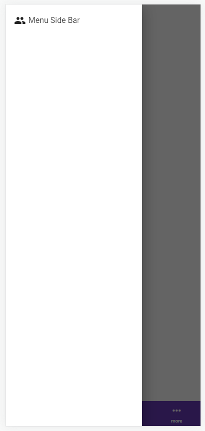

<h1>THPH Angular Version 13</h1> 
 
#npm run build
 
Mobile menu nodejs version 16
 
 
#ติดตั้ง Angular CLI เวอร์ชัน 13 แบบ global
 
npm uninstall -g @angular/cli  # ลบ CLI เวอร์ชันปัจจุบัน 
npm install -g @angular/cli@13  # ติดตั้ง CLI เวอร์ชัน 13 
mysql workbench 6.3 ce  

    

        
    

    

        
    

